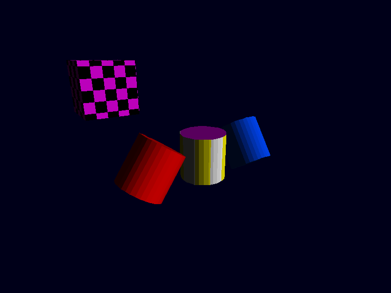
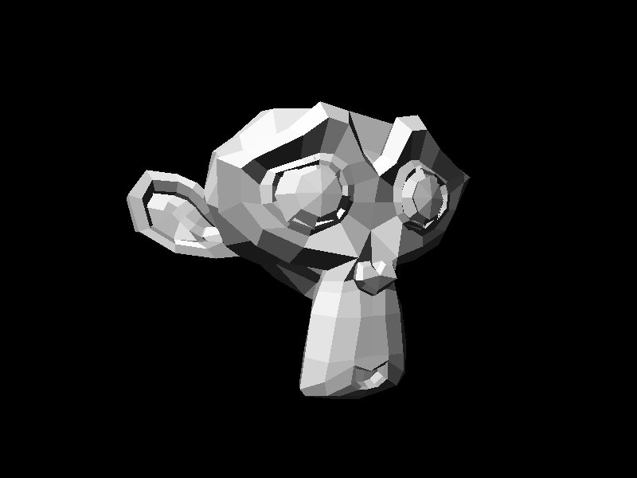
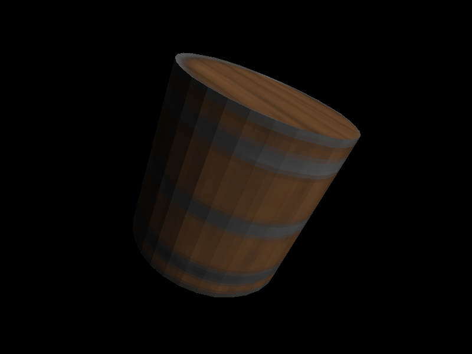

# The Root Game Engine
Root is a 3D software rasterizer written in Python, using
1. *pygame* for visuals, as well as keyboard and mouse input for control
2. *numpy* to perform matrix calculations
3. *cProfile* and *pstats* for testing the speed of parts of the program
4. *PIL* for loading textures
5. *Cython* and *setuptools* to convert inefficient python code into C.

The Engine is split into layers, which handles different aspects of the processing per frame.
* A Scene Management system, which loads objects, places them in world space, and indicated frame actions.
* Game file outline, which then directs how the objects interact programmatically, as well as direct what player input does.
* A Drawing layer for creating the final frame, including
  * A Camera system for describing FOV, focal length, perspective projection, etc.
  * Back Face culling, Frustum culling, and Traingle clipping to avoid extra compute time
  * Lighting system, using multiple light features to give a light value for each polygon
  * Rasterizer for drawing textures onto objects

## Example Images
Here is a typical frame, using all of the current scene options for rotation, orbiting, and background, and lighting.

This shows a non-rasterized image of Suzane, the blender monkey.

This is a better example of a textured object.

## References
[mattbattwings' video](https://www.youtube.com/watch?v=hFRlnNci3Rs) on 3D rendering using Minecraft Redstone was the initial inspiration for the project.

[Wikipedia's 3D Projection Article](https://en.wikipedia.org/wiki/3D_projection) was an initial resource for understanding the math for perspective projection

[Sebastian Lague's video on software rasterization](https://youtu.be/yyJ-hdISgnw?si=SNsnYBDJCmlBea_G) has acted as a very helpful resource, as well as general guideline for what features to implement.